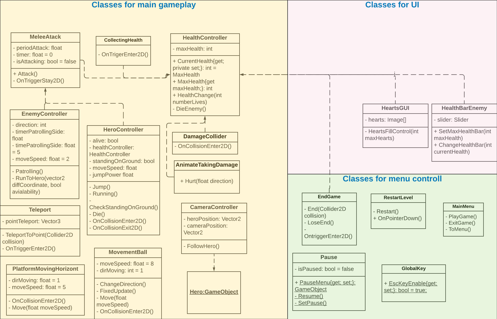

# Ellie's Adventures

## About game
Ellie's Adventures is a free, open-source, 2D plaftormer game.

## Open project in Unity 
1. Install the [Unity Hub](https://unity3d.com/get-unity/download).
2. Set up correct download from Git. Open console.
    * If you work on Windows input:
        ```
        git config core.autocrlf true
        ```
    * if you work on Linux or MacOS input:  
        ```
        $ git config core.autocrlf input
        ```
        or
        ```
        $ git config core.autocrlf false
        ```
    
3. Fork, clone remote repository to your local machine.
4. Add folder with project in Unity Hub.
5. Open project.
6. Install assets needed for the project:
    1. Follow to https://assetstore.unity.com/;
    2. Install list of assets from RequiredAssets.txt.
7. Done!

## Build project
1. Open project in Unity. 
2. File -> Build Settings. Choose your settings.
3. Enter "Build".

## License 
The Ellie's Adventures game is open-sourced software licensed under the **Apache License 2.0**. 
 
## Contacts
Elton Aslanov [peepquik@gmail.com](mailto:peepquik@gmail.com).

## Architecture 


